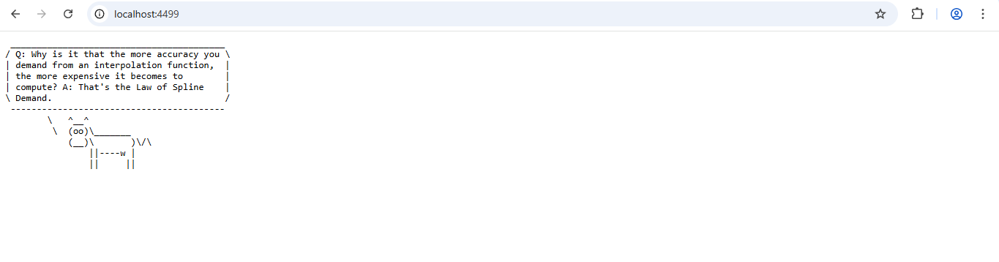
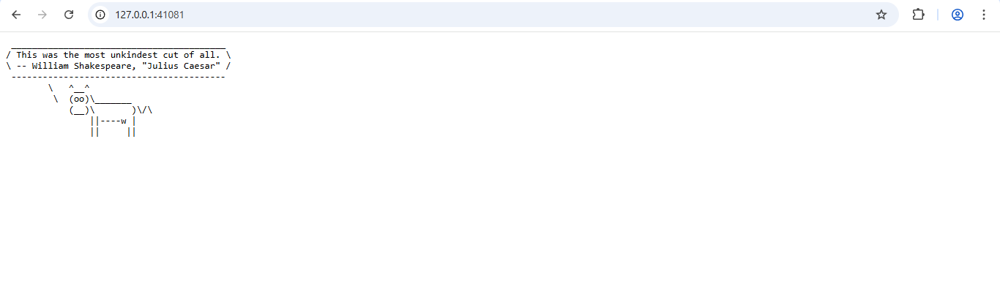
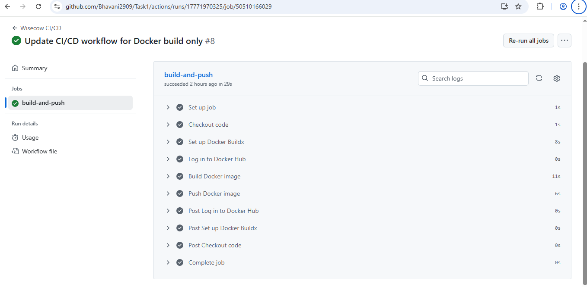
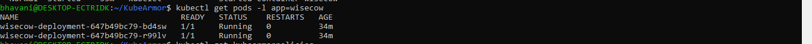
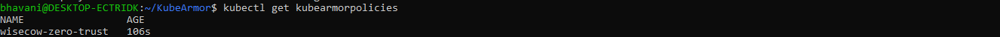
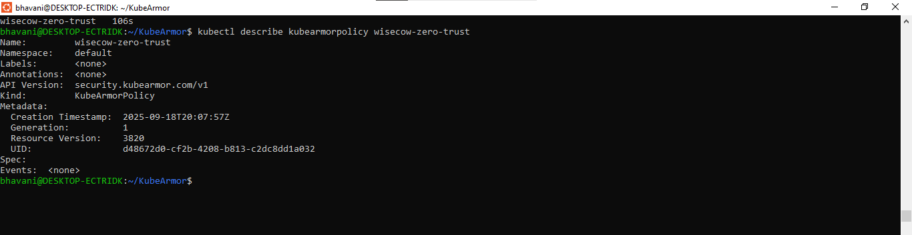

# Task 1 & 3: Wisecow Application - Kubernetes Deployment and Zero-Trust Policy

## Overview

This repository contains the implementation of **Task 1 and Task 3**:

- **Task 1:** Containerization and deployment of the [Wisecow application](https://github.com/nyrahul/wisecow) on a Kubernetes environment (Kind/Minikube) with automated CI/CD and TLS support.
- **Task 3 (Optional/Challenge):** Application of a zero-trust KubeArmor policy to the deployed Kubernetes workload.

---

## Problem Statement 1: Containerization and Deployment

**Objective:**  
To containerize the Wisecow application and deploy it on Kubernetes with secure TLS communication, automated CI/CD, and accessibility as a service.

### Implementation Details

#### 1. Dockerization
- A **Dockerfile** has been created to build the Wisecow application container image.
- The image can be built locally or via the GitHub Actions workflow.

#### 2. Kubernetes Deployment
- Kubernetes manifest files include:
  - **Deployment**: Deploys the Wisecow application pods.
  - **Service**: Exposes the application within the cluster.
  - **Ingress (Optional)**: Configured with TLS for secure communication.
- TLS is implemented to ensure encrypted communication.

#### 3. CI/CD Pipeline
- **GitHub Actions** workflow automates:
  - Docker image build and push to a container registry.
  - Continuous deployment to the Kubernetes cluster after successful builds.
- Workflow file: `.github/workflows/ci-cd.yml`

### How to Run
1. Clone the repository:
   ```bash
   git clone https://github.com/Bhavani2909/Task1-and-3.git
   cd Task1-and-3
   ```
2. Build Docker image:
   ```bash
   docker build -t wisecow-app:latest .
   ```
3. Deploy to Kubernetes:
   ```bash
   kubectl apply -f k8s/
   ```
4. Access the application via the Kubernetes service or configured Ingress URL (with TLS).

---

## Problem Statement 3: Zero-Trust KubeArmor Policy

**Objective:**  
Implement a zero-trust security policy using [KubeArmor](https://docs.kubearmor.io/) for the Wisecow workload deployed in Task 1.

### Implementation Steps
1. Created a **KubeArmor policy YAML** to enforce zero-trust security controls.
2. Applied the policy to the Kubernetes cluster:
   ```bash
   kubectl apply -f kubearmor-policy.yaml
   ```

### Artifacts
- `kubearmor-policy.yaml`: The KubeArmor policy file.

---

## Repository Structure

```
Task1-and-3/
│
├─ Dockerfile
├─ k8s/
│   ├─ deployment.yaml
│   ├─ service.yaml
│   ├─ ingress.yaml (optional)
├─ .github/
│   └─ workflows/
│       └─ ci-cd.yml
├─ kubearmor-policy.yaml
└─ README.md
```
## 📷 Screenshots

### Task-1 Curl Output


### Task-1 LocalHostOutput


### Task-1 ResultOnNodePort


### 📝 Task-1 CI/CD Workflow


### ⏰ Task-3 Pods Running


### ⏰ Task-3 Policies Attached


### ⏰ Task-3 ServicePolicyDescription

---

## Tools & Technologies
- **Docker** – Containerization
- **Kubernetes (Kind/Minikube)** – Deployment environment
- **GitHub Actions** – CI/CD automation
- **TLS/Ingress** – Secure communication
- **KubeArmor** – Zero-trust policy enforcement

---

## Conclusion
This project demonstrates:
- Containerization of the Wisecow application.
- Deployment to a Kubernetes cluster with TLS.
- CI/CD automation with GitHub Actions.
- Implementation of zero-trust security policies using KubeArmor.

---

## References
- [Wisecow GitHub Repository](https://github.com/nyrahul/wisecow)  
- [KubeArmor Documentation](https://docs.kubearmor.io/)

